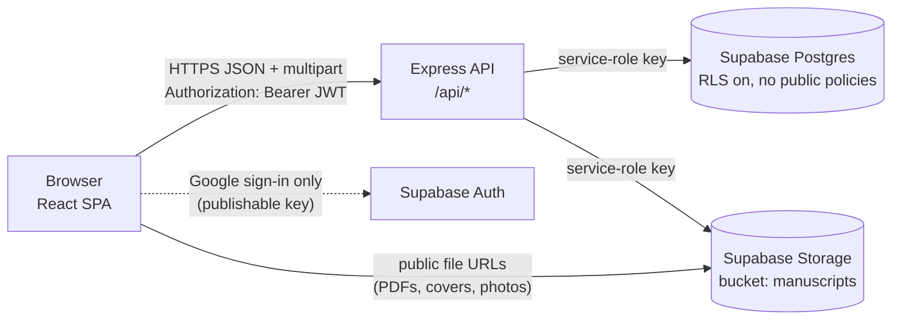
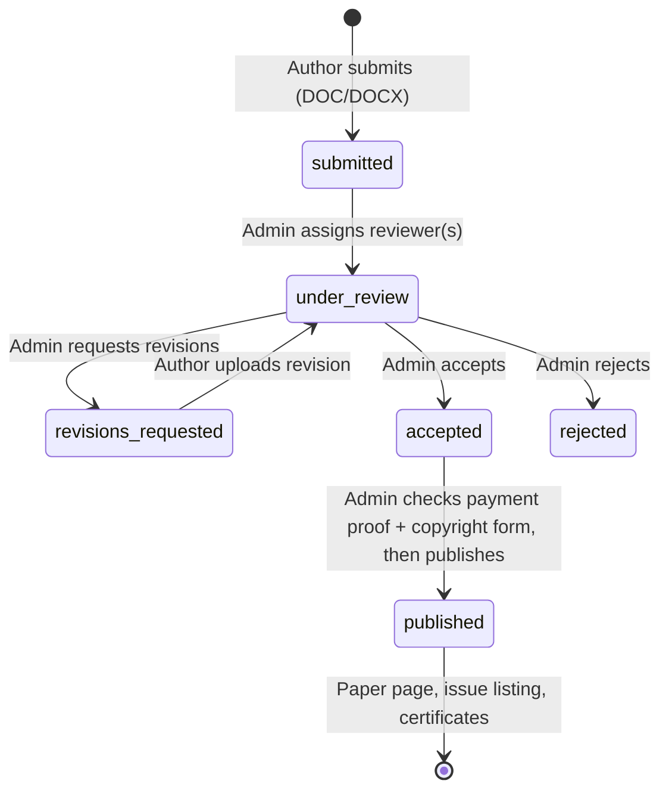

<div align="center">


# IJEPA — Journal Platform

**International Journal of Engineering Practices and Applications**

Peer-reviewed, open-access journal platform: manuscript submission, double-blind peer review, editorial decisions, publication, issues and certificates, all in one web app.


[Live site](https://ijepa.org) · [Launch checklist](LAUNCH_CHECKLIST.md) · [Audit report](AUDIT_V3.md) · [Walkthrough video](docs/walkthrough.mp4)

</div>

---

## Table of contents

- [Overview](#overview)
- [Features](#features)
- [Tech stack](#tech-stack)
- [Architecture](#architecture)
- [Paper lifecycle](#paper-lifecycle)
- [Getting started](#getting-started)
- [Environment variables](#environment-variables)
- [Available scripts](#available-scripts)
- [Project structure](#project-structure)
- [API reference](#api-reference)
- [Data model and storage](#data-model-and-storage)
- [Security](#security)
- [Deployment](#deployment)
- [Branching and release workflow](#branching-and-release-workflow)
- [Troubleshooting](#troubleshooting)
- [Contributing](#contributing)
- [License](#license)

---

## Overview

IJEPA is a monthly, peer-reviewed, open-access engineering journal (ISSN 3139-5961, published by Buildsoftech Publication). This repository contains the complete platform behind the journal:

- a **public website**: home, current issue, archives, paper pages, author guidelines, call for papers, editorial board and contact;
- **role-based dashboards** for authors, reviewers and administrators;
- an **Express API** that owns all business rules and talks to **Supabase** (Postgres and file storage).

The browser never reads database tables directly. Every read and write goes through the API, which enforces authentication, roles and ownership.

## Features

### Public site
- Home page with the **current issue** and an **archive** of earlier papers.
- Journal issues and archives by volume, with downloadable full-issue PDFs.
- **Paper pages** (`/p/:id`) with abstract, authors, keywords, DOI, an inline PDF viewer and Google Scholar `citation_*` meta tags.
- Paper search and browsing.
- Content pages: About, Indexing, Author Guidelines, Call for Papers, Editorial Board, Join Us, Contact, Privacy and Terms.
- Generated `sitemap.xml` listing every published paper.

### Authors
- Guided **six-step submission form**:
  - live validation and autosaved drafts;
  - co-authors;
  - keyword tags;
  - 150–300-word abstract;
  - subject area (the journal's list, plus "Other" with free text).
- Manuscripts are **DOC/DOCX only** at first submission, as the Author Guidelines require.
- Status tracking with a progress stepper, reviewer feedback and **revision uploads**.
- After acceptance:
  - **signed copyright form** upload;
  - **article processing charge (APC)** payment: UPI QR code or bank transfer, then a **payment proof** upload.
- A downloadable **Certificate of Publication** for each published paper.

### Reviewers
- Assigned manuscripts are **anonymised** (double-blind): no author names.
- In-browser PDF viewer with a reviewer watermark. Word manuscripts are offered as a download.
- Rating, recommendation and comments.
- A downloadable **Certificate of Reviewing** for each reviewed paper once it is published.

### Administrators
- Submission management:
  - assign reviewers;
  - read reviews;
  - request revisions;
  - accept, reject and publish (with an optional DOI).
- Check **payment proofs** and **copyright forms** before publishing. "Mark fee as paid" is available when a record is wanted.
- Submit papers on an author's behalf; replace manuscript and copyright files.
- **Issue manager**: volume, number, month, title, description, cover image and full-issue PDF. Set the current issue and assign papers.
- **Editorial board** editor with profile photo upload.
- **Important dates** editor with a calendar picker (or "To be announced").
- In-app notifications for every workflow step.

## Tech stack

| Layer | Technology |
|---|---|
| Frontend | React 18 (Create React App), React Router 6, Tailwind CSS 3 with a custom token-based design system (`src/index.css`), `react-pdf` / `pdfjs-dist` |
| Backend | Node.js 20, Express 4, Multer (in-memory uploads), `jsonwebtoken`, `bcryptjs`, Morgan |
| Data | Supabase Postgres with Row Level Security enabled, and Supabase Storage |
| Auth | Email and password (bcrypt hashes, JWTs issued by the API); Google sign-in through Supabase Auth |
| Payments | Manual UPI / bank transfer with proof upload; optional Razorpay Checkout |
| Hosting | Vercel (frontend) and Render (API) for staging; Nginx and PM2 on a VPS for production (see [LAUNCH_CHECKLIST.md](LAUNCH_CHECKLIST.md)) |

## Architecture



- **The API is the only way into the data.** RLS is enabled on every table with no public policies, so the publishable key shipped to browsers can't read or write tables. The API uses the service-role key, which bypasses RLS.
- **Uploads go browser → API → Storage.** The API checks each file's extension, type and actual file contents before storing it.
- **The frontend is a static build.** It's served by any static host with a single-page-app fallback to `index.html` (see `vercel.json`).

## Paper lifecycle



After acceptance the author uploads the signed copyright form and pays the APC:
- **Indian authors:** INR 1,500.
- **International authors:** USD 50.

Amounts are set on the server. Payment proofs are stored as files per paper, and admins are notified when one arrives.

## Getting started

### Prerequisites

- **Node.js 20** and npm
- A **Supabase** project (free tier is fine)

### 1. Clone and install

```bash
git clone https://github.com/adityapatil-air/paper.git
cd paper
npm install
cd backend && npm install && cd ..
```

### 2. Set up the database

In the Supabase dashboard, open **SQL Editor**, paste the contents of [`backend/supabase_schema.sql`](backend/supabase_schema.sql) and run it. It creates every table and enum and enables Row Level Security. It is the single source of truth for the schema.

The storage bucket (`manuscripts`) is created automatically the first time the API starts.

### 3. Configure environment variables

```bash
cp .env.example .env
cp backend/.env.example backend/.env
```

Fill in the values (see [Environment variables](#environment-variables)). At minimum you need:
- in `backend/.env`: `SUPABASE_URL`, `SUPABASE_SERVICE_ROLE_KEY` and `JWT_SECRET`;
- in `.env`: the `REACT_APP_*` values.

Generate a JWT secret with:

```bash
node -e "console.log(require('crypto').randomBytes(48).toString('hex'))"
```

### 4. Run

Start each server in its own terminal:

```bash
cd backend && npm run dev
```

```bash
npm start
```

| Service | URL |
|---|---|
| Web app | http://localhost:3005 |
| API | http://localhost:4000 (health check: `/api/health`) |

### 5. Create an admin

Register at `/register`. New accounts are always **authors**. Then, in Supabase → **Table Editor** → `users`, change that row's `role` to `admin` (or `reviewer`).

## Environment variables

### Frontend (`.env`, read at build time)

| Variable | Required | Example | Purpose |
|---|---|---|---|
| `REACT_APP_API_URL` | ✅ | `http://localhost:4000` | Base URL of the API (no trailing slash) |
| `REACT_APP_SITE_URL` | ✅ | `http://localhost:3005` | Public site URL, used for canonical links |
| `REACT_APP_SUPABASE_URL` | ✅ | `https://xyz.supabase.co` | Supabase project URL (Google sign-in) |
| `REACT_APP_SUPABASE_ANON_KEY` | ✅ | `sb_publishable_…` | Publishable key. Safe in the browser, because RLS blocks table access |
| `PORT` | – | `3005` | Local dev server port |

> Every `REACT_APP_*` value is built into the public JavaScript. **Never put a secret here.**

### Backend (`backend/.env`)

| Variable | Required | Default | Purpose |
|---|---|---|---|
| `SUPABASE_URL` | ✅ | – | Supabase project URL |
| `SUPABASE_SERVICE_ROLE_KEY` | ✅ | – | Service-role / secret key. **Server only** |
| `JWT_SECRET` | ✅ | – | Signs session tokens. The server refuses to start without it |
| `PORT` | – | `4000` | API port (set automatically on Render) |
| `FRONTEND_ORIGIN` | – | `http://localhost:3000` | The deployed site's origin |
| `TRUST_PROXY` | – | `false` | Set `true` behind Nginx or Render so rate limits see real client IPs |
| `SUPABASE_STORAGE_BUCKET` | – | `manuscripts` | Storage bucket for all uploads |
| `RAZORPAY_KEY_ID` / `RAZORPAY_KEY_SECRET` | – | – | Enables optional online checkout; manual payment works without them |
| `RAZORPAY_WEBHOOK_SECRET` | – | – | Optional Razorpay webhook verification |
| `APC_INR` / `APC_USD` | – | `1500` / `50` | Article processing charge amounts |

## Available scripts

| Where | Command | What it does |
|---|---|---|
| root | `npm start` | Runs the React dev server with hot reload |
| root | `npm run build` | Builds the production bundle into `build/` |
| root | `npm test` | Runs the Create React App test runner (no test suites yet) |
| `backend/` | `npm run dev` | Starts the API |
| `backend/` | `npm start` | Starts the API with `NODE_ENV=production` |
| `backend/` | `node scripts/build_sitemap.js` | Regenerates `public/sitemap.xml` from published papers |
| `backend/` | `node scripts/ingest_papers.js [--insert]` | One-off back-catalogue importer: preview to CSV, then insert |

## Project structure

```text
.
├── public/                    # index.html, icons, manifest, robots.txt, sitemap.xml
├── src/
│   ├── App.js                 # Routes; dashboards and viewers are lazy-loaded
│   ├── index.css              # Design tokens and all component styles
│   ├── assets/                # Logo, hero illustration, templates, UPI QR
│   ├── config/                # Static config (payment account details)
│   ├── contexts/AuthContext.js
│   ├── data/mockData.js       # API client (named "mockAPI" for history; calls the real API)
│   ├── components/
│   │   ├── ui/                # Modal, ConfirmDialog, Toast, FilePicker, StatusBadge, Skeleton…
│   │   ├── admin/IssueEditor.js
│   │   ├── ArticleCard.js, CurrentIssue.js, Header.js, Footer.js, ProtectedRoute.js
│   └── pages/                 # One file per route (Landing, SubmitForm, dashboards, Certificate…)
├── backend/
│   ├── supabase_schema.sql    # Full database schema (single source of truth)
│   ├── scripts/               # Sitemap generator, back-catalogue importer
│   └── src/
│       ├── index.js           # Express app, CORS, JSON parsing, route mounting
│       ├── storage.js         # Upload validation, Storage upload/list/remove helpers
│       ├── middleware/        # requireAuth / requireRole, requireAdmin, rate limiting
│       └── routes/            # auth, papers, submissions, reviews, admin, issues,
│                              # payments, settings, notifications, certificates
├── vercel.json                # SPA rewrites for Vercel
├── ecosystem.config.js        # PM2 config for VPS hosting
└── LAUNCH_CHECKLIST.md        # Step-by-step deployment and go-live guide
```

## API reference

All endpoints are prefixed with `/api`. Authenticated calls send `Authorization: Bearer <token>`.

**Access levels:**
- **Public:** no login.
- **Auth:** any signed-in user.
- **Owner:** the paper's author.
- **Admin:** administrators only.

| Area | Method and path | Access |
|---|---|---|
| Health | `GET /health` | Public |
| Auth | `POST /auth/register`, `POST /auth/login` (rate-limited) | Public |
| Papers | `GET /papers/published`, `GET /papers/:id`, `GET /papers/:id/download` | Public for published papers; otherwise author, assigned reviewer or admin |
| | `GET /papers` | Auth (scoped to the user's role) |
| | `POST /papers`, `DELETE /papers/:id` | Auth / Admin |
| Submissions | `POST /submissions` (DOC/DOCX) | Auth |
| | `POST /submissions/:paperId/revision` | Owner, only when revisions were requested |
| | `POST /submissions/:paperId/copyright` (PDF) | Owner, after acceptance |
| Reviews | `POST /reviews` | Reviewer assigned to the paper |
| | `GET /reviews/reviewer/:id`, `GET /reviews/paper/:id/for-author` | Reviewer / Owner |
| | `GET /reviews`, `GET /reviews/paper/:id` | Admin |
| Admin | `GET /admin/reviewers`, `POST /admin/assign-reviewer`, `/accept-paper`, `/request-revisions`, `/reject-paper`, `/publish-paper`, `/mark-paid`, `/papers/:paperId/files` | Admin |
| Issues | `GET /issues`, `GET /issues/:id/papers`, `GET /issues/assignments` | Public |
| | `POST /issues`, `PUT /issues/:id`, `DELETE /issues/:id`, `POST /issues/:id/set-current`, `POST /issues/:id/assign-paper`, `DELETE /issues/:id/assign-paper/:paperId` | Admin |
| Payments | `GET /payments/key` (fees, whether online checkout is on) | Public |
| | `POST /payments/proof/:paperId`, `GET /payments/proof/:paperId` | Owner (GET also Admin) |
| | `POST /payments/create-order`, `POST /payments/verify-payment` | Owner (optional Razorpay) |
| | `POST /payments/webhook` | Razorpay signature |
| Settings | `GET /settings/important-dates`, `GET /settings/editorial-board` | Public |
| | `POST /settings/important-dates`, `POST /settings/editorial-board`, `POST /settings/editorial-board/photo` | Admin |
| Notifications | `GET /notifications`, `POST /notifications/:id/read`, `DELETE /notifications/:id` | Auth (own notifications) |
| Certificates | `GET /certificates/mine`, `GET /certificates/:type/:paperId` (`review` / `author`) | Eligible reviewer / author of a published paper |

Errors use a consistent shape: `{ "success": false, "error": "Human-readable message", "code": "OPTIONAL_CODE" }`.

## Data model and storage

**Tables** (full definitions in `backend/supabase_schema.sql`):

| Table | Purpose |
|---|---|
| `users` | Accounts, roles (`author`, `reviewer`, `admin`, `editor`), bcrypt password hashes |
| `papers` | Manuscripts: status, abstract, keywords, category, files, DOI, fee and payment status |
| `paper_authors` | Detailed author and co-author records per paper |
| `review_assignments` / `reviews` | Who reviews what, and the submitted reviews |
| `issues` / `issue_papers` | Journal issues and the papers published in them |
| `notifications` | In-app notifications |
| `site_settings` | Key/value JSON: important dates and the editorial board |

**Enums:**
- `paper_status`: `submitted → under_review → revisions_requested → accepted → published`, or `rejected`.
- `payment_status`: `pending`, `paid`.

**Storage layout** (bucket `manuscripts`):

```text
user-<id>/manuscripts/    initial submissions
user-<id>/revisions/      revised manuscripts
user-<id>/copyright/      signed copyright forms
payment-proofs/paper-<id>/  APC payment screenshots / receipts
issues/…                  issue PDFs and cover images
papers/vol1-issue<n>/     imported back-catalogue PDFs
editorial-board/          member profile photos
```

## Security

- **RLS on every table, with no public policies.** The browser key can't touch data; only the API (service role) can.
- **Server-side authorisation on every write.**
  - Roles are checked with `requireRole` / `requireAdmin`.
  - Ownership is checked for author actions.
  - Reviewers only see papers assigned to them, with author identities hidden.
- **The server fails closed.** It won't start without `JWT_SECRET`.
- **Sign-in and registration are rate-limited** (set `TRUST_PROXY=true` behind a proxy).
- **Uploads are validated.** Each file field has an allowed-types list, there's a 20 MB limit, and the API checks the file's actual contents (magic bytes), not just its extension.
- **Payments:** amounts are always computed on the server. Razorpay signatures are verified with a constant-time comparison.
- **Secrets never go in git.** All `.env*` files are git-ignored except the `.env.example` templates.

> **Known limitation:** the storage bucket is public, so anyone who has a file's direct URL can open it. Moving unpublished files to a private bucket with signed URLs is on the roadmap. See `AUDIT_V3.md`.

## Deployment

| Environment | Frontend | API | Branch |
|---|---|---|---|
| Staging / client review | Vercel (`vercel.json` handles SPA rewrites) | Render web service (root `backend`, start `npm start`, health `/api/health`) | `dev` |
| Production | Nginx serving `build/` | PM2 (`ecosystem.config.js`) behind Nginx `/api` proxy, TLS via Certbot | `dev` → production |

- **Keep the API off Vercel functions:** they reject request bodies over about 4.5 MB, and manuscripts can be up to 20 MB.
- **After deploying, update the Supabase Auth URLs:** set the Site URL and Redirect URLs to the new domain, and add it to the Google OAuth authorised origins.
- **The full step-by-step guide,** including environment values, DNS, SSL and a post-launch smoke test, is in **[LAUNCH_CHECKLIST.md](LAUNCH_CHECKLIST.md)**.

## Branching and release workflow

| Branch | Role |
|---|---|
| `testing` | Day-to-day development. All changes land here first |
| `dev` | Stable, deployed branch. Vercel and Render auto-deploy on every push |
| `main` | Legacy default |

Release a tested change:

```bash
git checkout dev
```
```bash
git merge testing
```
```bash
git push origin dev
```
```bash
git checkout testing
```

Both branches share one Supabase project. Any schema change must be additive, and it should be applied only when the code that needs it reaches `dev`.

## Troubleshooting

| Symptom | Cause and fix |
|---|---|
| `EADDRINUSE :::4000` | Another API process is already running. Stop it (Ctrl+C in its terminal) or change `PORT`. |
| API exits immediately mentioning `JWT_SECRET` | `JWT_SECRET` is missing from `backend/.env`. Generate one (see [Getting started](#getting-started)). |
| Pages load but papers or login fail | `REACT_APP_API_URL` is wrong or the API isn't running. Check `GET /api/health`. After changing any `REACT_APP_*` value, restart `npm start` or redeploy. |
| Vercel build fails on a lint warning | CI builds treat warnings as errors. Run `CI=true npm run build` locally and fix the reported line. |
| Refreshing `/admin-dashboard` shows 404 in production | The host is missing the SPA fallback. Use `vercel.json` on Vercel or `try_files $uri /index.html` on Nginx. |
| First request on Render takes about 50 s | The free instance was asleep. Upgrade the plan or wake it before demos. |
| "Sign in with Google" fails on a new domain | Add the domain to Supabase Auth → URL Configuration and to the Google OAuth origins. |

## Contributing

1. Branch from `testing`, and keep each change focused on one thing.
2. Follow the existing patterns:
   - UI primitives from `src/components/ui/`;
   - design tokens and classes in `src/index.css`, not inline styles;
   - API calls through `src/data/mockData.js`;
   - authorisation checks on the server.
3. Before opening a pull request, run a CI-strict build and click through the affected flow for each role:
   ```bash
   CI=true npm run build
   ```
4. Write commit messages in the imperative, and explain *why*, not only *what*.

## License

Proprietary. © Buildsoftech Publication. All rights reserved unless the owner publishes a license file in this repository.
